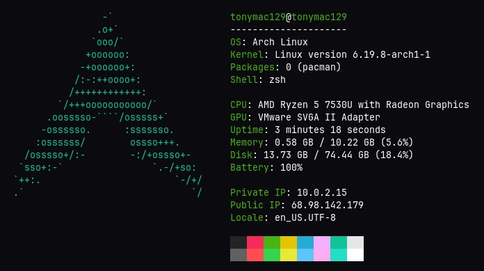

# Slowfetch - a simple, lightweight alternative for Fastfetch/Neofetch!

Slowfetch is a simple CLI tool that reads your device's hardware, operating system, and runtime information and outputs them in a clean, organized, and visually appealing list so you can access the statistics quickly! (plus, you also get to flex the beautiful, glorious, majestic, perfect, and breathtaking logo of your operating system!)

## Features

Slowfetch outputs a colored ASCII logo of the distro if it's Debian, Arch, Ubuntu, or Fedora, otherwise it shows a default Linux logo. It also lists some useful system and hardware information/statistics, categorized into three sections, which include:

- User's username and the device's hostname
- OS and Kernel names and versions
- Number of packages installed and the package manager
- Current shell environment
- CPU and GPU models
- Current uptime in a readable format
- Current memory and disk usage along with a percentage
- Current battery percentage
- Private IP
- Public IP, which can be censored by passing a "--censor" or "-c" flag
- System locale
- Rectangle composed of 16 blocks of different colors

## Getting started

To use Slowfetch on your operating system (it's only available for Linux):

1. Download the executable from the [releases](https://github.com/tonymac129/slowfetch/releases) page
2. `cd` into the directory containing the downloaded `slowfetch` file
2. Run `chmod +x slowfetch` to make the downloaded Slowfetch file an executable
3. Run `sudo mv slowfetch /usr/local/bin` to move the file into the binary path directory
4. `slowfetch` should now be recognized as a command and running it outputs the logo and stats!

To set up the development environment for Slowfetch using Cargo:

1. Clone this project with `git clone https://github.com/tonymac129/slowfetch.git`
2. Make sure you have Rust, Cargo, and other necessary build tools installed
3. Change into the directory, and run `cargo run`
4. You should be able to see the output of Slowfetch!

## Tech stack

- Rust for the core logic since this is supposed to be a ~~slow~~ fast fetching program 🦀
- Cargo because this is a Rust project and everything written in Rust uses Cargo
- The std library to interact with the system and owo-colors for color coding